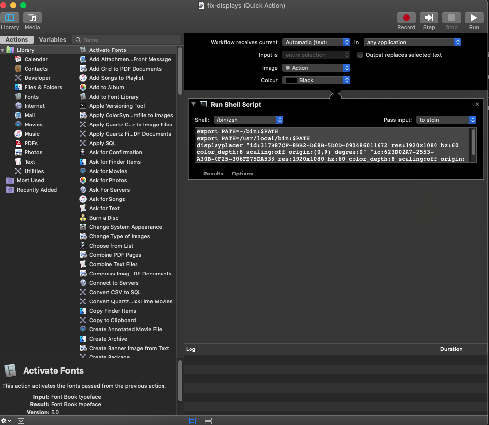
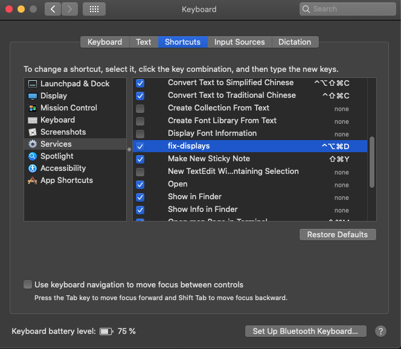

## Install displayplacer
```bash
brew tap jakehilborn/jakehilborn && brew install displayplacer
```
## Get current display settings
```bash
displayplacer list
```
Copy kast line of output e.g.

```bash
displayplacer "id:317B87CF-8BB2-D68B-5D0D-090486011672 res:1920x1080 hz:60 color_depth:8 scaling:off origin:(0,0) degree:0" "id:623D02A7-2553-A30B-0F25-306FE75DA533 res:1920x1080 hz:60 color_depth:8 scaling:off origin:(1920,0) degree:0"
```

## MAC automator
- Run mac automator
- Select new quick action
- Select utilities -> run bash script
- add following to script section
  ```bash
    export PATH=~/bin:$PATH
    export PATH=/usr/local/bin:$PATH
    displayplacer "id:317B87CF-8BB2-D68B-5D0D-090486011672 res:1920x1080 hz:60 color_depth:8 scaling:off origin:(0,0) degree:0" "id:623D02A7-2553-A30B-0F25-306FE75DA533 res:1920x1080 hz:60 color_depth:8 scaling:off origin:(1920,0) degree:0"
  ```
- save workflow
  


## Keyboard shortcut
- Run system preferences -> keyboard -> shortcuts -> services
- select service from above automator step
- choose a shortcut
  


## Edit existing automator workflows
- run Finder 
- Options -> go menu -> library
- double tap a workflow
- or ~/Library

